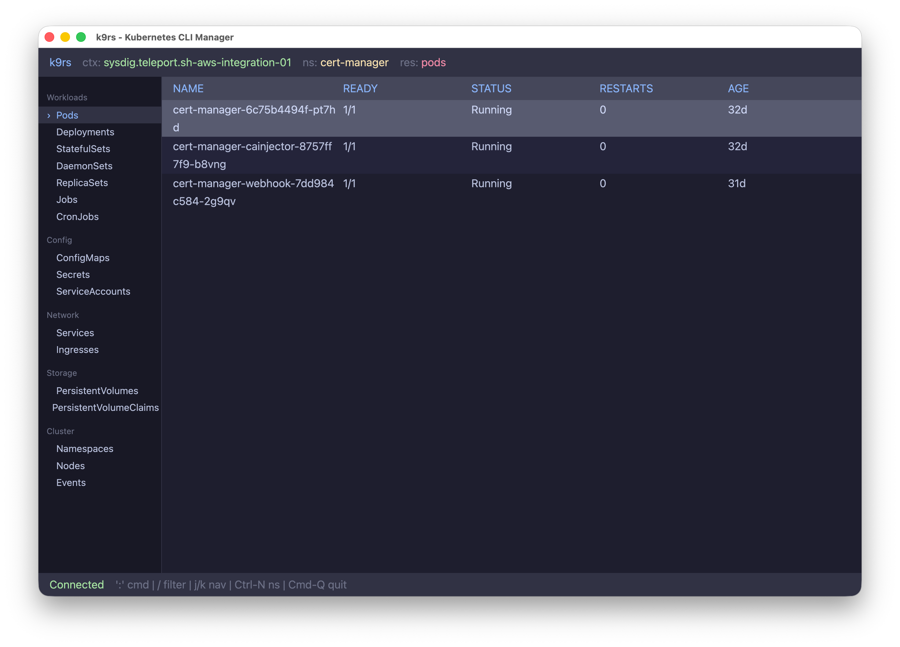

# k9rs

A GPU-accelerated Kubernetes CLI manager written in Rust, inspired by [k9s](https://k9scli.io/). Built with [GPUI](https://www.gpui.rs/) (the UI framework from [Zed](https://zed.dev/)) for native performance and a modern desktop experience.



## Features

- **GPU-accelerated UI** powered by GPUI with Catppuccin Mocha theme
- **Resource browser** for 17+ Kubernetes resource types organized by category
- **Resource sidebar** with categorized navigation (Workloads, Config, Network, Storage, Cluster)
- **Detail panel** with tabs:
  - **Overview** — status, metadata, labels, annotations, conditions, containers, and workload pod listing
  - **YAML** — full syntax-highlighted editor with editing support (powered by [gpui-component](https://github.com/longbridge/gpui-component))
  - **Events** — related events in tabular format
  - **Logs** — pod log viewer (last 500 lines, loaded on demand)
- **YAML editing** — edit resource YAML in-place with syntax highlighting, then apply with `Ctrl+S`
- **Port forwarding** — press `f` on a pod to start a port forward, manage active forwards via `:pf`
- **Namespace switching** — picker overlay with type-to-filter (`Ctrl+N`) or via `:ns` command
- **Resource filtering** — press `/` to filter table rows across all columns
- **Command mode** — k9s-style `:` commands with aliases (`po`, `deploy`, `svc`, `ns`, etc.)
- **Restart resources** — rollout restart for Deployments/StatefulSets/DaemonSets, delete for Pods
- **Live refresh** — pod status and conditions auto-refresh every 5 seconds in detail view
- **Mouse support** — clickable sidebar, table rows, detail tabs, pod names, and restart button
- **Loading spinners** — animated indicators during async data fetching
- **CLI arguments** — start with a specific namespace, context, or resource type

## Requirements

- **Rust** (stable, latest recommended)
- **macOS** or **Linux** (GPUI requirement — macOS uses Metal, Linux uses Vulkan)
- **kubectl** configured with a valid kubeconfig
- **Metal Toolchain** on macOS (`xcodebuild -downloadComponent MetalToolchain`)

## Installation

```bash
git clone https://github.com/your-username/k9rs.git
cd k9rs
cargo build --release
```

The binary will be at `target/release/k9rs`.

## Usage

```bash
# Start with defaults (pods in default namespace)
k9rs

# Start in a specific namespace
k9rs -n kube-system

# Use a specific context
k9rs -c my-cluster

# Start showing a specific resource
k9rs -r deployments

# Combine options
k9rs -n monitoring -r services -c production
```

## Keyboard Shortcuts

### Navigation

| Key | Action |
|-----|--------|
| `j` / `k` | Move selection up/down |
| `Enter` | Open detail view / confirm |
| `Esc` | Go back / close overlay |
| `Tab` | Toggle focus between sidebar and table |

### Commands

| Key | Action |
|-----|--------|
| `:` | Activate command mode (type resource aliases like `po`, `deploy`, `svc`) |
| `/` | Activate filter mode (type to filter rows) |
| `Ctrl+N` | Open namespace picker |
| `r` | Restart selected resource |
| `f` | Port forward selected pod |
| `Ctrl+S` | Apply edited YAML (in YAML tab) |
| `Cmd+Q` | Quit |

### Detail View

| Key | Action |
|-----|--------|
| `1` | Overview tab |
| `2` | YAML tab |
| `3` | Events tab |
| `4` | Logs tab |
| `Esc` | Close detail view |

### Port Forward Dialog

| Key | Action |
|-----|--------|
| `j` / `k` | Select remote port |
| Type digits | Set local port |
| `Enter` | Start port forward |
| `Esc` | Cancel |

### Port Forward List (`:pf`)

| Key | Action |
|-----|--------|
| `j` / `k` | Navigate forwards |
| `d` | Stop selected forward |
| `Esc` | Close list |

### Resource Aliases (Command Mode)

| Alias | Resource |
|-------|----------|
| `po` | Pods |
| `dp` / `deploy` | Deployments |
| `svc` | Services |
| `no` | Nodes |
| `ns` | Namespaces |
| `ds` | DaemonSets |
| `sts` | StatefulSets |
| `rs` | ReplicaSets |
| `cm` | ConfigMaps |
| `sec` | Secrets |
| `sa` | ServiceAccounts |
| `ing` | Ingresses |
| `pv` | PersistentVolumes |
| `pvc` | PersistentVolumeClaims |
| `ev` | Events |
| `cj` | CronJobs |
| `job` | Jobs |
| `pf` | Port Forwards (list) |

## Architecture

```
src/
├── main.rs              # Entry point, window setup, keybindings, theme
├── app.rs               # AppView — main state machine and render logic
├── k8s/
│   ├── client.rs        # Kubernetes API client (list, detail, logs, restart, apply, port-forward)
│   └── runtime.rs       # Tokio runtime bridge for async k8s calls in GPUI
├── model/
│   ├── detail.rs        # ResourceDetail, PodInfo, ContainerInfo, etc.
│   ├── port_forward.rs  # PortForwardEntry, PodPort, PortForwardStatus
│   ├── resources.rs     # Resource type definitions and sidebar categories
│   └── table.rs         # TableData, TableRow, TableColumn
└── ui/
    ├── detail_panel.rs       # Detail view with tabs (Overview, YAML, Events, Logs)
    ├── header.rs             # Top bar (context, namespace, resource)
    ├── namespace_picker.rs   # Modal namespace selector
    ├── port_forward_dialog.rs # Modal port-forward setup dialog
    ├── port_forward_list.rs  # Modal active port-forwards list
    ├── resource_table.rs     # Main resource table with click support
    ├── sidebar.rs            # Left panel with resource categories
    └── status_bar.rs         # Bottom bar (status, commands, filter)
```

### Key Design Decisions

- **Dual runtime**: GPUI has its own async executor, but `kube-rs` requires Tokio. A dedicated Tokio runtime runs in the background, bridged via `spawn_on_tokio()`.
- **GPUI Root wrapper**: The `gpui-component` library requires its `Root` view as the window root. Our `AppView` is wrapped inside it.
- **Focus-based key dispatch**: GPUI dispatches key bindings based on focus context. The app root tracks focus via `FocusHandle` + `track_focus()`.
- **Explicit `cx.notify()`**: GPUI doesn't auto-notify on state changes — every mutation must call `cx.notify()` to trigger re-render.
- **Port forwarding**: Uses `kubectl port-forward` as a background process with `kill_on_drop` for clean lifecycle management.

## Tech Stack

| Component | Crate |
|-----------|-------|
| UI Framework | [gpui](https://crates.io/crates/gpui) |
| UI Components | [gpui-component](https://crates.io/crates/gpui-component) |
| Kubernetes Client | [kube](https://crates.io/crates/kube) + [k8s-openapi](https://crates.io/crates/k8s-openapi) |
| Async Runtime | [tokio](https://crates.io/crates/tokio) |
| CLI Parsing | [clap](https://crates.io/crates/clap) |
| Serialization | [serde](https://crates.io/crates/serde) + [serde_yml](https://crates.io/crates/serde_yml) |

## License

MIT
